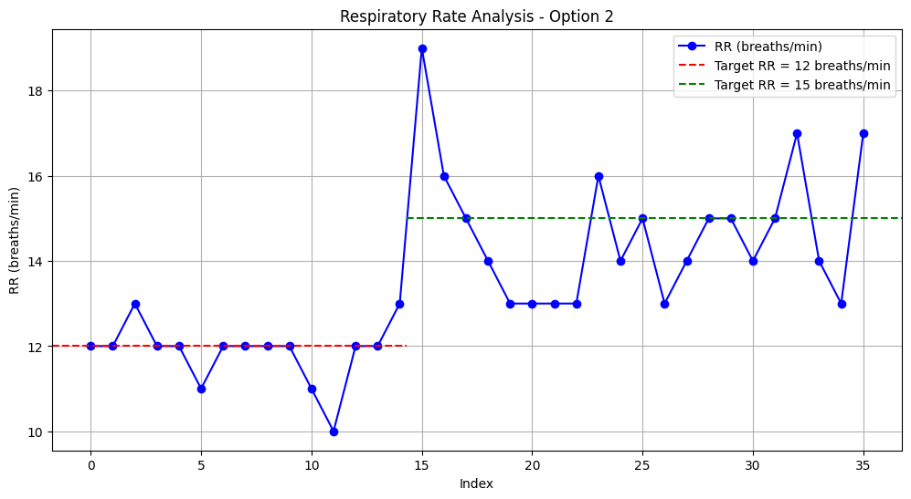

<h1 align="center"> B(R)EAT(H) </h1>

## Getting Started
### Clone the repository
Run the command on your terminal at the desired location:
```
git clone git@github.com:ltebs-polimi/AY2324_II_Project-1.git
```
### Dependencies
It is recommended to create a virtual environment to run the GUI. This can be done by running on your terminal:
```
python -m virtualenv GUI_venv
```
The latest versions of these libraries should then be installed within the virtual environment:
- ```PyQt5```
- ```numpy```
- ```scipy```
- ```pandas```
- ```openpyxl```
- ```pyqtgraph```
- ```os```
- ```sys```
- ```time```
- ```logging```
- ```struct```
- ```subprocess```
- ```sqlite3```
- ```csv```
- ```datetime```
- ```serial```
## Filetree
Directories are organized as follows:
```
││├───CASE
│││   └──STL files
│││
││├───GUI
│││   ├──pyqt5_venv
│││   └──GUI.py
│││
││├───PCB
│││   ├──B(R)EAT(H).bdr
│││   └──B(R)EAT(H).sch
│││
││└───PSoC_code
││    ├──GatheringData.cydsn
││       │
││       ├───Generated_Source
││       │   └───PSoC5
││       └───TopDesign
││
│└───Validation_Study
│    ├──Output_Measurements
│    └──Plots
│
└───Images

```

## Intro
There are several methods for assessing general respiratory health. The most common methods are pulmonary function tests (PFTs) that range from simple spirometry, which can be used to assess a patient’s airflow, to full body plethysmography used to assess lung volumes. Other methods include arterial blood sampling and diffusion capacity. While these evaluations are effective in assessing a patient’s respiratory health at a specific point in time in a laboratory setting, they cannot continuously monitor a patient’s respiratory state under normal daily environments. Moreover, PFTs such as spirometry require the patient to breathe maximally into a mouthpiece, a maneuver that is challenging, which makes these types of tests difficult to ensure accurate readings and are not suitable for long term use.[^1] Other methods for sensing the respiratory signal include measuring airflow through the nostrils with a pressure transducer in combination with a spirometer, and tracking chest wall movement with a piezoelectric belt.[^2] These techniques are essential for monitoring breathing of patients with respiartory disorders,chronic obstructive pulmonary disease, or neuromuscolar disorders, as they allow for the assessment of the stability of their conditions. 
An emergin area of interest is the use of motion sensors, such as accelerometers fixed on the chest or abdomen, as a comfortable, and cheap method for respiratory monitoring. The main aim of the study group is to evaluate the feasibility of implementing an accelerometry-based portable device as a simple and cost-effective solution for monitoring breathing patterns and parameters.
Respiratory disorders significantly impair lung capacity and respiratory function thus the need of developing an accurate monitoring to prevent sever conmplication and to adjust therapies promptly. Traditional monitoring techniques, although effective, can be cumbersome and uncomfrtable for partients, restricting their mobility. Therefore, developing portable devices based on accelerometers could revolutionize the clincial management of these patients by providing precise data onc hest and abdominal movements associated with breathing, enabling continuous and non-invasive monitoring. This approach could enhance the quality of life for patients by allowing them to perform daily axctivities with fewer restrictions while ensuring accurate monitoring of their clinical condition.

However,beside the developed technical features, the ethics behind measuring the subject's respiratory parameters should also be considered. The primary goal of clinical research is to develop generalizable knowledge that improves human health or increases understanding of human biology. People who participate in clinical research make it possible to secure that knowledge ensuring at the same time that subjects involved do not suffer violations of their rights, as clinical trials can expose them to significant risks. The purpose of ethical guidelines is both to protect patient volunteers and to preserve the integrity of science.[^3]


The details of the project are discussed in the following sections:
- [Hardware](#hardware)
- [Firmware](#firmware)
- [Processing](#processing)
- [Graphical user interface](#graphical-user-interface)
- [Acquisition Protocol](#acquisition-protocol)  
- [Limitations and future developments](#limitations-and-future-developments)


   <br> 

## Hardware
### Reference Folder: `PCB`, `Case_3Dprint`
  
B(R)EAT(H) is a wereable device mainly composed by LIS3DH accelerometer hold to a 3D printed support case and then fixed position on the abdomen of the subject via an elastic band.  

<br> 

<div align="center">


</div>

<br>

The electronic circuit has been simulated in breaboard before designing the PCB.   
The electronical components used for the main module are: 
- Psoc 5LP, accelerometer LIS3DH, bluetooth module HC-O5, 9V alkaline battery, switch, linear voltage regulator LM7805, resistors (330Ω 3x), capacitors (0.1 μF 1x, 0.33μF 1x)
<br>


### 3D Printed Case design discussion:
- The 3D printed case is meant to contain the PCB with all the peripherals except for the accelerometer, which is instead fixed through screws and worn on the front of the subject depending on the user selected protocol and fixed in position by an elastic band. They were both built using Tinkercad app.

Below you can see the case for holding the accelerometer:

<br> 

<div align="center">


</div>

<br>

While here it is represented the 3d printed case design:

<br> 

<div align="center">


</div>

<br>


### Hardware functioning discussion:
- The accelerometer LIS3DH communicates with the microcontroller via I2C master-slave communication, whereas the bluetooth module communicates via UART communication.
- The accelerometer has also a connection between its interrupt pin and 2.2 pin of the microcontroller, so that it can trigger an interrupt when data are available. 
- The PSOC 5LP and all the peripherals run on 5V, so the 9V of the battery is reduced and stabilized to 5V by the linear voltage regulator LM7805 and capacitors. 
- Resistors are used to limit the current running in the RGB led and to reduce the TX signal sent by the microcontroller to the bluetooth module from 5V to 3.3V, to cope with the HC-05 input pin limitations. 
- The active buzzer is used to advice the operator that the patient is breathing in a non phisiological way.
- The RBG LED is meant to signal the connection status of the device. Initially, while the device is not yet paired with the laptop, the LED will blink in RED driven by a PWM signal with a period of 1 second and duty cycle of 50%. Successful pairing is then flagged via a fixed blue light, while during data streaming a fixed green light is shown.

From a hardware perspective, we have considered three distinct methods for interaction between the subject and the device. 
First, the subject can control the device's power using an external switch to turn it on or off. 
Second, an RGB LED provides communication with the caregiver by indicating the device’s functional status. 
Finally, the buzzer serves as an additional alert mechanism, sounding an alarm if physiological measurements exceed predefined thresholds. This setup ensures that caregivers receive immediate notifications not only through the app screen but also via a distinct auditory signal.

Here it is possible to appreciate the whole device mounted on the designed PCB obtained through the press and peel technique:

<br> 

<div align="center">


</div>

<br>


## Firmware
### Reference Folder: `PSoC_CODE`
In this section it is reported the description of the code written using PSoC Creator, regarding the firmware functionalities of the PSoC5LP for commanding B(R)EAT(H) device. In the "main.c" file we have the main recommended settings for RR measurement such as: 
- 12bit resolution with high power configuration. 
- +2/-2g full scale.
- 200Hz as ODR (Output Data Rate).

Regarding "InterruptRoutines.c", the ISR function "CY_ISR(Custom_ISR_Data)" is called whenever a new value of acceleration on the Z-axis is available. This triggers the call of the script where the data is reconstructed into its binary representation and sent to the UART TX, corresponding to the RX of the HC05 for Bluetooth communication. The data stream is triggered whenever the caregiver starts the connection with the device from the GUI, which corresponds on writing a letter "s" to the TX of the HC05, associated with the RX of the UART of the PSoC through the ISR function "CY_ISR(Custom_ISR_RX)". Indeed, this function manages signals written to the TX pin of the HC05 for setting the BUZZER,LED_R,LED_B,LED_G and PWM components depending on the device operating status. This ensures that the app user can communicate with the device both from the PSoC to the GUI through the HC05, and then back from the GUI to the PSoC. This allows to have a better interaction and dinamism in the use of the app.
The ISR function "CY_ISR(Custom_ISR_RX)" is commands the RGB led and BUZZER based on the character received from the GUI which is linked to the functioning status of the device. When turned on, the PWM on LED_R blinks with a frequency of 1 second and a duty cycle of 50%. Successful pairing is then flagged via a fixed blue light, while a fixed green light is shown during data streaming. If the RR parameter is out of physiological range, depending on the selected acquistion protocol, the active BUZZER is activated to alert the caregivers drawing attention to the subject's breathing and activity that triggered the BUZZER. 


## Processing
### Reference Folder: `GUI`

For the device, two distinct data processing procedures were developed: one for real-time data processing and the other for offline data processing.

#### Real-Time Data Processing

Multiple processing techniques were developed and tested. The chosen method, despite its apparent simplicity, proved to be the most effective considering both the quality of filtering and the adaptation time. The final steps for real-time processing are as follows:
- The acquired data from the serial worker is added to a buffer ('data_buffer') that stores all the measured acceleration values coming from the accelerometer.
- A moving average filter is applied to the buffered data to smooth rapid fluctuations and stabilize the signal. The chosen window size is 200 points, corresponding to 1 second of acquisition. If the buffer contains fewer than 200 data points, the filter will wait until the chosen window size is reached to start.
- Then, a third order low-pass Butterworth filter is applied to the moving average filtered data, with a chosen cutoff frequency of 0.6 Hz. The buffer size must contain at least 12 data points before applying the filter; otherwise, the filter waits until this limit is reached.
- After this processing, the peaks and lows are identified in the signal using the find_peaks algorithm from the SciPy library. This step identifies both the points of maximum, which indicate the end of an inspiration and the beginning of an expiration, and the points of minimum, which indicate the opposite in the acceleration signal. To distinguish between real and local minima and maxima, a prominence level is chosen. Specifically, when the subject is standing, the chosen prominence is 0.15, while when sitting, it is 0.05.
- To better compute the parameters and allow the filters time to adapt, the first fiducial point identified is always a minimum. If a maximum is identified before the first minimum, it is discarded. This ensures that the filtered signal always begins with the start of a respiratory cycle.
- After these computations, the parameters are computed. The chosen parameters are: the instantenous respiratory rate, the inspiratory time, the expiratory time and the inspiratory/expiratory ratio. Each of these parameters is updated every new cycle detected.
- Starting from the instantaneous RR, it is calculated as the difference between the time index of two subsequent minima. At least two lows are required to calculate this time difference.
- The inspiratory time is calculated as the time elapsed between a peak and the previous detected minimum. At least one minimum and the subsequent peak are required for this computation.
- The expiratory time is calculated as the time elapsed between a peak and the next detected minimum. At least one peak and the subsequent minimum are required for this computation.
- Finally, the Inspiratory/Expiratory (I/E) ratio is computed as the ratio between the inspiratory time and expiratory time of each detected cycle.

The real-time data processing is summarized in the flowchart below:

<br> 

<div align="center">


</div>

<br>

#### Offline Data Processing

An offline data processing feature was added to allow users to view previous recordings. The steps followed for offline processing are as follows:
- The data are loaded from a CSV file into a DataFrame.
- The first filtering step is performed by removing the DC offset from the data by subtracting the mean of the signal from each data point
- Then, a third-order bandpass Butterworth filter is applied, with chosen cutoff frequencies 0.1 Hz and 0.6 Hz
- The peaks and lows of the filtered signal are detected once again using the 'find_peaks' algorithm from the SciPy library. A prominence criterion of 0.01 is applied to distinguish between real peaks and lows from local fluctuations.
- Multiple adjacent peaks and adjacent lows are often found. To address this issue, adjacent peaks and lows are grouped, and the midpoint is computed to obtain accurate fiducial points.
- The parameters are then extracted. Specifically, the mean respiratory rate, mean inspiratory time, mean expiratory time, and inspiratory/expiratory ratio are computed.

The offline data processing is summarized in the flowchart below:

<br> 

<div align="center">


</div>

<br>

## Graphical user interface
### Reference Folder: `GUI`

The application was developed with the primary objective of tailoring the user experience for each individual using the device. It was designed to be accessible and intuitive, ensuring efficiency and ease of use. This chapter provides a detailed, step-by-step explanation of all the landing pages and functionalities designed within the application.

#### Login Page: `LOGIN.py`

The first page features a secure login interface. Users who are already registered on the device, can enter their credentials to proceed. Otherwise, they have the option to register themselves on the registration page. The system enforces a simply password policy requiring it to be greater than 10 characters, otherwise a notification is displayed on the screen for advicing the user of this requirement.
The main functioning of both the LOGIN.py and USER.py scripts relies on the SQLite database which is needed to be installed in the device currently running B(R)EAT(H) app. For sake of clarity, the database in our project is called "user.db".

<br> 

<div align="center">


</div>

<br>

#### Registration Page: `USER.py`

On the registration page, new users can create an account. The fields included in the registration are First Name, Last Name, Phone Number, Email Address, Username, and Password, but only the latter two are mandatory at this moment for privacy reasons. Once the new user submits their information, their details are registered in a local database ('user.db'). This database is then referenced when the user logs in. After registration, the user can return to the login page and log in with their newly created credentials.

<br> 

<div align="center">


</div>

<br>

#### Acquistion Mode Choice: `Protocol.py`

As the users log in, they are presented with a selection interface for choosing the acquisition mode. Specifically, they can select from four different positions for the acquisition:
- Option 1: The subject is standing, and the accelerometer is placed on the subject's chest.
- Option 2: The subject is standing, and the accelerometer is placed on the subject's abdomen.
- Option 3: The subject is sitting, and the accelerometer is placed on the subject's abdomen.
- Option 4: The subject is sitting, and the accelerometer is placed on the subject's chest.

These different placements for the accelerometer accommodate the fact that different subjects may exhibit either chest or abdominal respiration, allowing for a more accurate and individualized data collection.

As seen from the GIF below, the page is personalized with the name of the logged-in user. Once one of the options is selected, it is highlighted, and the "Enter" button becomes available.

<br> 

<div align="center">


</div>

<br>

#### Dashboard: `PythonGUI.py`

Upon acquisition mode selection, users are directed to the main data acquisition screen. This interface is designed for real-time data visualization, enabling users to monitor respiratory patterns and view computed parameters.
The primary area of the screen is dedicated to a chart that displays real-time data from the device. Several controls are included to operate on the app. The following image displays all of them, and then we will farther investigate the functionalities.

<br> 

<div align="center">


</div>

<br>

At the bottom of the screen:
- Combobox for Connecting Device Selection: allows users to select the device to connect to. (1)
- Scan: scans for available Bluetooth (BT) devices for connection. This button is connected to the 'serialscan' function. (2)
- Connect/Disconnect: toggles between connecting and disconnecting to the chosen device. This button is connected to both the 'serial_connect' and 'serial_disconnect' functions.(3)
- Start Acquisition/Stop Acquisition: toggles between starting and stopping the data acquisition. This button is connected to both the 'start_acquisition' and 'stop_acquisition' functions. It is made available only when the app is successfully connected to the device. This triggers the sending of the letter "s" to the HC-05 for the triggering of the sending of the stream of data. If Stop Acquisition is pressed, the letter "v" is sent to the PSoC for stopping the streaming. (4)
- Save: allows users to locally save the raw data acquired during the session. When pressed, the user's local directory opens, and they can choose where to save the data as a CSV file. The file is saved with the name format "Username"+"Acquisition Mode"+"Start Time"+"End Time". It is made available only when the acquisition stream is stopped. (5)
- Show Summary: displays a table with all the instantaneous parameters computed during the acquisition. It is made available only when the acquisition stream is stopped. (6)

On the top right of the screen two buttons are available:
- Reset: allows the user to reset all the data, including both raw data and filtered data, as well as the computed parameters. This button can be pressed either during an acquisition or afterward before starting a new session. (7)
- Switch to Filtered Data/Switch to Raw Data: toggles between displaying the raw data chart and the filtered data chart, providing users with the option to view either the raw data or the processed, filtered data. (8)
Moreover, it is possible to see the name of the user displayed.

On the top left of the screen there are two tabs:
- File: from this tab the user can:
   - Start acquisition
   - Stop acquisition
   - Save data
   - Load data: Allows users to upload raw data acquired during a previous session. Initially, only the raw data are displayed. However, after pressing the 'Switch to Filtered Data' button, filtering and peak detection are performed, and the mean Respiratory Rate (RR), mean Inspiratory Time, mean Expiratory Time, and I/E Ratio are displayed in the parameters boxes. (9)
- ?: displays instructions regarding the usage of the application. (10)

Finally, on the right side of the screen, we have two main elements:
- Parameters Boxes: These boxes display the values of various parameters, computed as explained in the processing chapter. These parameters include mean Respiratory Rate (RR), mean Inspiratory Time, mean Expiratory Time, and the I/E Ratio. Whenever physiological treshold are overcome, a letter "o" is sent to the PSoC for triggering the BUZZER alarm and Switching on the LED_G. (11)
- Acquiring Method Switch Button: This button not only indicates the current acquisition method but also allows users to change the acquisition mode without repeating the login procedure. When pressed, it opens the acquisition mode selection interface. (12)

## Validation: `Validation.ipynb`

The validation of the device could not be performed using a gold standard device due to its unavailability. Consequently, we conducted the validation using three distinct protocols to assess the repeatability and sensitivity of the device. Each protocol was repeated three times for each subject across all four available acquisition modalities to ensure sufficient data for statistical analysis. The protocols were as follows:

- Protocol 1: The subject was asked to maintain a respiratory cycle of 12 breaths per minute (5-second cycles) for 1 minute.
- Protocol 2: The subject was asked to maintain a respiratory cycle of 15 breaths per minute (4-second cycles) for 1 minute.
- Protocol 3: The subject was asked to maintain a respiratory cycle of 12 breaths per minute (5-second cycles) for 30 seconds, followed by a respiratory cycle of 15 breaths per minute (4-second cycles) for the next 30 seconds.
Additionally, we performed Protocol 4, where the subject breathed freely while being recorded to observe the correspondence between the observed movement and the acquired data.

After acquiring the data, all computed parameters were saved. The RRs were plotted in a graph, with the goal respiratory cycle displayed, allowing for qualitative analysis of the device's performance. For quantitative analysis, basic statistics were computed: mean squared error (MSE), mean absolute error (MAE), root mean square error (RMSE), and the standard deviation. These statistics were calculated for each protocol and each acquisition option separately, as well as providing an overall insight into the performance across all protocols.

Due to time constraints in completing the prototype, the full validation process was conducted on only one subject. However, to assess inter-subject variability to some extent, Protocols 1 and 3 were performed on a second subject, with one acquisition per option. Although this sample size is not statistically significant, it provides preliminary insights for the project and is deemed acceptable for the current stage.
Moreover, the validation focused on proving the efficacy of the Respiratory Rate (RR) computation. Indeed, following a strict protocol for monitored inspiration and expiration proved to be very challenging. The use of a gold standard device is crucial for the accurate validation of these parameters.

### Results for the First Subject
### Protocol 1 Results

The results obtained for Protocol 1 are hereby reported:

##### Option 1
<br> 
<table>
    <tr>
        <td>
            
        </td>
        <td>
            <table border="1">
                <tr>
                    <th>Misura</th>
                    <th>Valore</th>
                </tr>
                <tr>
                    <td>MSE</td>
                    <td>1.27</td>
                </tr>
                <tr>
                    <td>MAE</td>
                    <td>0.8</td>
                </tr>
                <tr>
                    <td>RMSE</td>
                    <td>1.13</td>
                </tr>
                <tr>
                    <td>Standard Deviation</td>
                    <td>1.07</td>
                </tr>
            </table>
        </td>
    </tr>
</table>
<br>

##### Option 2
<br> 
<table>
    <tr>
        <td>
            
        </td>
        <td>
            <table border="1">
                <tr>
                    <th>Misura</th>
                    <th>Valore</th>
                </tr>
                <tr>
                    <td>MSE</td>
                    <td>0.74</td>
                </tr>
                <tr>
                    <td>MAE</td>
                    <td>0.68</td>
                </tr>
                <tr>
                    <td>RMSE</td>
                    <td>0.86</td>
                </tr>
                <tr>
                    <td>Standard Deviation</td>
                    <td>0.83</td>
                </tr>
            </table>
        </td>
    </tr>
</table>
<br>

##### Option 3
<br>
<table>
    <tr>
        <td>
            
        </td>
        <td>
            <table border="1">
                <tr>
                    <th>Misura</th>
                    <th>Valore</th>
                </tr>
                <tr>
                    <td>MSE</td>
                    <td>0.45</td>
                </tr>
                <tr>
                    <td>MAE</td>
                    <td>0.45</td>
                </tr>
                <tr>
                    <td>RMSE</td>
                    <td>0.67</td>
                </tr>
                <tr>
                    <td>Standard Deviation</td>
                    <td>0.62</td>
                </tr>
            </table>
        </td>
    </tr>
</table>
<br>

##### Option 4
<br> 
<table>
    <tr>
        <td>
            
        </td>
        <td>
            <table border="1">
                <tr>
                    <th>Misura</th>
                    <th>Valore</th>
                </tr>
                <tr>
                    <td>MSE</td>
                    <td>1.69</td>
                </tr>
                <tr>
                    <td>MAE</td>
                    <td>0.94</td>
                </tr>
                <tr>
                    <td>RMSE</td>
                    <td>1.30</td>
                </tr>
                <tr>
                    <td>Standard Deviation</td>
                    <td>1.30</td>
                </tr>
            </table>
        </td>
    </tr>
</table>
<br>

##### Overall
<br> 
<table>
    <tr>
        <td>
            
        </td>
        <td>
            <table border="1">
                <tr>
                    <th>Misura</th>
                    <th>Valore</th>
                </tr>
                <tr>
                    <td>MSE</td>
                    <td>1.05</td>
                </tr>
                <tr>
                    <td>MAE</td>
                    <td>0.72</td>
                </tr>
                <tr>
                    <td>RMSE</td>
                    <td>1.02</td>
                </tr>
                <tr>
                    <td>Standard Deviation</td>
                    <td>1.01</td>
                </tr>
            </table>
        </td>
    </tr>
</table>
<br>

#### Protocol 1 Discussion

The results from Protocol 1 demonstrate that the device performs best when the accelerometer is placed on the abdomen while the subject is sitting, as indicated by the lowest MSE, MAE, RMSE, and standard deviation. This suggests that the abdomen placement is more stable and less affected by external movements compared to the chest placement. However, it is important to highlight that, despite the abdomen placement showing superior stability, the chest placement also performed well and remains a viable option.

### Protocol 2 Results

The results obtained for Protocol 2 are hereby reported:

##### Option 1
<br> 
<table>
    <tr>
        <td>
            
        </td>
        <td>
            <table border="1">
                <tr>
                    <th>Misura</th>
                    <th>Valore</th>
                </tr>
                <tr>
                    <td>MSE</td>
                    <td>4.92</td>
                </tr>
                <tr>
                    <td>MAE</td>
                    <td>1.24</td>
                </tr>
                <tr>
                    <td>RMSE</td>
                    <td>2.22</td>
                </tr>
                <tr>
                    <td>Standard Deviation</td>
                    <td>2.06</td>
                </tr>
            </table>
        </td>
    </tr>
</table>
<br>

##### Option 2
<br> 
<table>
    <tr>
        <td>
            
        </td>
        <td>
            <table border="1">
                <tr>
                    <th>Misura</th>
                    <th>Valore</th>
                </tr>
                <tr>
                    <td>MSE</td>
                    <td>1.0</td>
                </tr>
                <tr>
                    <td>MAE</td>
                    <td>0.67</td>
                </tr>
                <tr>
                    <td>RMSE</td>
                    <td>1.0</td>
                </tr>
                <tr>
                    <td>Standard Deviation</td>
                    <td>0.82</td>
                </tr>
            </table>
        </td>
    </tr>
</table>
<br>

##### Option 3
<br>
<table>
    <tr>
        <td>
            
        </td>
        <td>
            <table border="1">
                <tr>
                    <th>Misura</th>
                    <th>Valore</th>
                </tr>
                <tr>
                    <td>MSE</td>
                    <td>0.74</td>
                </tr>
                <tr>
                    <td>MAE</td>
                    <td>0.59</td>
                </tr>
                <tr>
                    <td>RMSE</td>
                    <td>0.86</td>
                </tr>
                <tr>
                    <td>Standard Deviation</td>
                    <td>0.71</td>
                </tr>
            </table>
        </td>
    </tr>
</table>
<br>

##### Option 4
<br> 
<table>
    <tr>
        <td>
            
        </td>
        <td>
            <table border="1">
                <tr>
                    <th>Misura</th>
                    <th>Valore</th>
                </tr>
                <tr>
                    <td>MSE</td>
                    <td>1.58</td>
                </tr>
                <tr>
                    <td>MAE</td>
                    <td>0.78</td>
                </tr>
                <tr>
                    <td>RMSE</td>
                    <td>1.25</td>
                </tr>
                <tr>
                    <td>Standard Deviation</td>
                    <td>1.24</td>
                </tr>
            </table>
        </td>
    </tr>
</table>
<br>

##### Overall
<br> 
<table>
    <tr>
        <td>
            
        </td>
        <td>
            <table border="1">
                <tr>
                    <th>Misura</th>
                    <th>Valore</th>
                </tr>
                <tr>
                    <td>MSE</td>
                    <td>2.0</td>
                </tr>
                <tr>
                    <td>MAE</td>
                    <td>0.81</td>
                </tr>
                <tr>
                    <td>RMSE</td>
                    <td>1.41</td>
                </tr>
                <tr>
                    <td>Standard Deviation</td>
                    <td>1.32</td>
                </tr>
            </table>
        </td>
    </tr>
</table>
<br>

### Protocol 2 Discussion

Similar to Protocol 1, the results from Protocol 2 indicate that the device provides more accurate measurements when the accelerometer is placed on the abdomen, particularly when the subject is sitting. The highest errors are observed when the accelerometer is placed on the chest while standing, suggesting higher variability and potential interference from body movements, as it is possible to see from the two outliers seen in Option 1 chart.

### Protocol 3 Results

The results obtained for Protocol 3 are hereby reported:

##### Option 1
<br> 
<table>
    <tr>
        <td>
            
        </td>
        <td>
            <table border="1">
                <tr>
                    <th>Misura</th>
                    <th>Valore</th>
                </tr>
                <tr>
                    <td>MSE</td>
                    <td>0.87</td>
                </tr>
                <tr>
                    <td>MAE</td>
                    <td>0.73</td>
                </tr>
                <tr>
                    <td>RMSE</td>
                    <td>0.93</td>
                </tr>
                <tr>
                    <td>Standard Deviation</td>
                    <td>0.91</td>
                </tr>
            </table>
                        <table border="1">
                <tr>
                    <th>Misura</th>
                    <th>Valore</th>
                </tr>
                <tr>
                    <td>MSE</td>
                    <td>3.68</td>
                </tr>
                <tr>
                    <td>MAE</td>
                    <td>1.5</td>
                </tr>
                <tr>
                    <td>RMSE</td>
                    <td>1.92</td>
                </tr>
                <tr>
                    <td>Standard Deviation</td>
                    <td>1.76</td>
                </tr>
            </table>
        </td>
    </tr>
</table>
<br>

##### Option 2
<br> 
<table>
    <tr>
        <td>
            
        </td>
        <td>
            <table border="1">
                <tr>
                    <th>Misura</th>
                    <th>Valore</th>
                </tr>
                <tr>
                    <td>MSE</td>
                    <td>0.53</td>
                </tr>
                <tr>
                    <td>MAE</td>
                    <td>0.4</td>
                </tr>
                <tr>
                    <td>RMSE</td>
                    <td>0.73</td>
                </tr>
                <tr>
                    <td>Standard Deviation</td>
                    <td>0.72</td>
                </tr>
            </table>
                        <table border="1">
                <tr>
                    <th>Misura</th>
                    <th>Valore</th>
                </tr>
                <tr>
                    <td>MSE</td>
                    <td>2.62</td>
                </tr>
                <tr>
                    <td>MAE</td>
                    <td>1.29</td>
                </tr>
                <tr>
                    <td>RMSE</td>
                    <td>1.62</td>
                </tr>
                <tr>
                    <td>Standard Deviation</td>
                    <td>1.58</td>
                </tr>
            </table>
        </td>
    </tr>
</table>
<br>

##### Option 3
<br> 
<table>
    <tr>
        <td>
            
        </td>
        <td>
            <table border="1">
                <tr>
                    <th>Misura</th>
                    <th>Valore</th>
                </tr>
                <tr>
                    <td>MSE</td>
                    <td>1.0</td>
                </tr>
                <tr>
                    <td>MAE</td>
                    <td>0.73</td>
                </tr>
                <tr>
                    <td>RMSE</td>
                    <td>1.0</td>
                </tr>
                <tr>
                    <td>Standard Deviation</td>
                    <td>0.68</td>
                </tr>
            </table>
                        <table border="1">
                <tr>
                    <th>Misura</th>
                    <th>Valore</th>
                </tr>
                <tr>
                    <td>MSE</td>
                    <td>1.33</td>
                </tr>
                <tr>
                    <td>MAE</td>
                    <td>0.95</td>
                </tr>
                <tr>
                    <td>RMSE</td>
                    <td>1.15</td>
                </tr>
                <tr>
                    <td>Standard Deviation</td>
                    <td>1.65</td>
                </tr>
            </table>
        </td>
    </tr>
</table>
<br>

##### Option 4
<br> 
<table>
    <tr>
        <td>
            
        </td>
        <td>
            <table border="1">
                <tr>
                    <th>Misura</th>
                    <th>Valore</th>
                </tr>
                <tr>
                    <td>MSE</td>
                    <td>0.93</td>
                </tr>
                <tr>
                    <td>MAE</td>
                    <td>0.8</td>
                </tr>
                <tr>
                    <td>RMSE</td>
                    <td>0.97</td>
                </tr>
                <tr>
                    <td>Standard Deviation</td>
                    <td>0.96</td>
                </tr>
            </table>
                        <table border="1">
                <tr>
                    <th>Misura</th>
                    <th>Valore</th>
                </tr>
                <tr>
                    <td>MSE</td>
                    <td>0.85</td>
                </tr>
                <tr>
                    <td>MAE</td>
                    <td>0.65</td>
                </tr>
                <tr>
                    <td>RMSE</td>
                    <td>0.92</td>
                </tr>
                <tr>
                    <td>Standard Deviation</td>
                    <td>0.74</td>
                </tr>
            </table>
        </td>
    </tr>
</table>
<br>

##### Overall
<br> 
<table>
    <tr>
        <td>
            
        </td>
        <td>
            <table border="1">
                <tr>
                    <th>Misura</th>
                    <th>Valore</th>
                </tr>
                <tr>
                    <td>MSE</td>
                    <td>0.83</td>
                </tr>
                <tr>
                    <td>MAE</td>
                    <td>0.67</td>
                </tr>
                <tr>
                    <td>RMSE</td>
                    <td>0.91</td>
                </tr>
                <tr>
                    <td>Standard Deviation</td>
                    <td>0.88</td>
                </tr>
            </table>
                        <table border="1">
                <tr>
                    <th>Misura</th>
                    <th>Valore</th>
                </tr>
                <tr>
                    <td>MSE</td>
                    <td>2.15</td>
                </tr>
                <tr>
                    <td>MAE</td>
                    <td>1.11</td>
                </tr>
                <tr>
                    <td>RMSE</td>
                    <td>1.48</td>
                </tr>
                <tr>
                    <td>Standard Deviation</td>
                    <td>1.31</td>
                </tr>
            </table>
        </td>
    </tr>
</table>
<br>

### Protocol 3 Discussion

Protocol 3's results reaffirm the trend observed in the previous protocols, with the abdomen placement providing the best results. The mixed breathing rates add complexity to the data, but the device handles these variations really well, with better performance noted during sitting positions.

### Discussion

The statistical analysis across the three protocols demonstrates that the B(R)EAT(H) device provides reliable respiratory rate (RR) measurements, particularly when the accelerometer is placed on the abdomen. This placement minimizes interference from chest movements, resulting in lower error rates and greater stability in the readings. It is important to note that the subject who performed the analysis prefers abdominal respiration, which may have contributed to these findings. Further inter-subject analyses are needed to validate this observation across a broader population.
Furthermore, the device exhibited high performance in both repeatability and sensitivity tests, maintaining good accuracy during stable breathing rates and correctly identifying sudden changes in respiratory rate. This highlights the device's robustness and effectiveness in various respiratory conditions.

### Results for the Second Subject
### Protocol 1 Results

The results obtained for Protocol 1 are hereby reported:

##### Option 1
<br> 
<table>
    <tr>
        <td>
            
        </td>
        <td>
            <table border="1">
                <tr>
                    <th>Misura</th>
                    <th>Valore</th>
                </tr>
                <tr>
                    <td>MSE</td>
                    <td>0.9</td>
                </tr>
                <tr>
                    <td>MAE</td>
                    <td>0.7</td>
                </tr>
                <tr>
                    <td>RMSE</td>
                    <td>0.95</td>
                </tr>
                <tr>
                    <td>Standard Deviation</td>
                    <td>0.94</td>
                </tr>
            </table>
        </td>
    </tr>
</table>
<br>

##### Option 2
<br> 
<table>
    <tr>
        <td>
            
        </td>
        <td>
            <table border="1">
                <tr>
                    <th>Misura</th>
                    <th>Valore</th>
                </tr>
                <tr>
                    <td>MSE</td>
                    <td>0.8</td>
                </tr>
                <tr>
                    <td>MAE</td>
                    <td>0.6</td>
                </tr>
                <tr>
                    <td>RMSE</td>
                    <td>0.89</td>
                </tr>
                <tr>
                    <td>Standard Deviation</td>
                    <td>0.8</td>
                </tr>
            </table>
        </td>
    </tr>
</table>
<br>

##### Option 3
<br>
<table>
    <tr>
        <td>
            
        </td>
        <td>
            <table border="1">
                <tr>
                    <th>Misura</th>
                    <th>Valore</th>
                </tr>
                <tr>
                    <td>MSE</td>
                    <td>0.83</td>
                </tr>
                <tr>
                    <td>MAE</td>
                    <td>0.5</td>
                </tr>
                <tr>
                    <td>RMSE</td>
                    <td>0.91</td>
                </tr>
                <tr>
                    <td>Standard Deviation</td>
                    <td>0.91</td>
                </tr>
            </table>
        </td>
    </tr>
</table>
<br>

##### Option 4
<br> 
<table>
    <tr>
        <td>
            
        </td>
        <td>
            <table border="1">
                <tr>
                    <th>Misura</th>
                    <th>Valore</th>
                </tr>
                <tr>
                    <td>MSE</td>
                    <td>1.09</td>
                </tr>
                <tr>
                    <td>MAE</td>
                    <td>0.91</td>
                </tr>
                <tr>
                    <td>RMSE</td>
                    <td>1.04</td>
                </tr>
                <tr>
                    <td>Standard Deviation</td>
                    <td>1.03</td>
                </tr>
            </table>
        </td>
    </tr>
</table>
<br>

##### Overall
<br> 
<table>
    <tr>
        <td>
            
        </td>
        <td>
            <table border="1">
                <tr>
                    <th>Misura</th>
                    <th>Valore</th>
                </tr>
                <tr>
                    <td>MSE</td>
                    <td>0.91</td>
                </tr>
                <tr>
                    <td>MAE</td>
                    <td>0.67</td>
                </tr>
                <tr>
                    <td>RMSE</td>
                    <td>0.95</td>
                </tr>
                <tr>
                    <td>Standard Deviation</td>
                    <td>0.95</td>
                </tr>
            </table>
        </td>
    </tr>
</table>
<br>

### Protocol 1 Discussion

The results indicate that the abdomen placement, particularly while sitting, provides more stable readings with lower error metrics. The chest placements show an improved performance compared to the first subject, with reduction in all error metrics, but still with slightly higher variability compared to the abdomen placement. 

### Protocol 3 Results

The results obtained for Protocol 3 are hereby reported:

##### Option 1
<br> 
<table>
    <tr>
        <td>
            
        </td>
        <td>
            <table border="1">
                <tr>
                    <th>Misura</th>
                    <th>Valore</th>
                </tr>
                <tr>
                    <td>MSE</td>
                    <td>0.4</td>
                </tr>
                <tr>
                    <td>MAE</td>
                    <td>0.4</td>
                </tr>
                <tr>
                    <td>RMSE</td>
                    <td>0.63</td>
                </tr>
                <tr>
                    <td>Standard Deviation</td>
                    <td>0.49</td>
                </tr>
            </table>
                        <table border="1">
                <tr>
                    <th>Misura</th>
                    <th>Valore</th>
                </tr>
                <tr>
                    <td>MSE</td>
                    <td>1.43</td>
                </tr>
                <tr>
                    <td>MAE</td>
                    <td>0.86</td>
                </tr>
                <tr>
                    <td>RMSE</td>
                    <td>1.20</td>
                </tr>
                <tr>
                    <td>Standard Deviation</td>
                    <td>0.83</td>
                </tr>
            </table>
        </td>
    </tr>
</table>
<br>

##### Option 2
<br> 
<table>
    <tr>
        <td>
            
        </td>
        <td>
            <table border="1">
                <tr>
                    <th>Misura</th>
                    <th>Valore</th>
                </tr>
                <tr>
                    <td>MSE</td>
                    <td>0.6</td>
                </tr>
                <tr>
                    <td>MAE</td>
                    <td>0.6</td>
                </tr>
                <tr>
                    <td>RMSE</td>
                    <td>0.77</td>
                </tr>
                <tr>
                    <td>Standard Deviation</td>
                    <td>0.49</td>
                </tr>
            </table>
                        <table border="1">
                <tr>
                    <th>Misura</th>
                    <th>Valore</th>
                </tr>
                <tr>
                    <td>MSE</td>
                    <td>1.0</td>
                </tr>
                <tr>
                    <td>MAE</td>
                    <td>0.71</td>
                </tr>
                <tr>
                    <td>RMSE</td>
                    <td>1.0</td>
                </tr>
                <tr>
                    <td>Standard Deviation</td>
                    <td>0.70</td>
                </tr>
            </table>
        </td>
    </tr>
</table>
<br>

##### Option 3
<br> 
<table>
    <tr>
        <td>
            
        </td>
        <td>
            <table border="1">
                <tr>
                    <th>Misura</th>
                    <th>Valore</th>
                </tr>
                <tr>
                    <td>MSE</td>
                    <td>0.4</td>
                </tr>
                <tr>
                    <td>MAE</td>
                    <td>0.4</td>
                </tr>
                <tr>
                    <td>RMSE</td>
                    <td>0.63</td>
                </tr>
                <tr>
                    <td>Standard Deviation</td>
                    <td>0.49</td>
                </tr>
            </table>
                        <table border="1">
                <tr>
                    <th>Misura</th>
                    <th>Valore</th>
                </tr>
                <tr>
                    <td>MSE</td>
                    <td>1.14</td>
                </tr>
                <tr>
                    <td>MAE</td>
                    <td>0.86</td>
                </tr>
                <tr>
                    <td>RMSE</td>
                    <td>1.07</td>
                </tr>
                <tr>
                    <td>Standard Deviation</td>
                    <td>1.03</td>
                </tr>
            </table>
        </td>
    </tr>
</table>
<br>

##### Option 4
<br> 
<table>
    <tr>
        <td>
            
        </td>
        <td>
            <table border="1">
                <tr>
                    <th>Misura</th>
                    <th>Valore</th>
                </tr>
                <tr>
                    <td>MSE</td>
                    <td>0.6</td>
                </tr>
                <tr>
                    <td>MAE</td>
                    <td>0.6</td>
                </tr>
                <tr>
                    <td>RMSE</td>
                    <td>0.77</td>
                </tr>
                <tr>
                    <td>Standard Deviation</td>
                    <td>0.49</td>
                </tr>
            </table>
                        <table border="1">
                <tr>
                    <th>Misura</th>
                    <th>Valore</th>
                </tr>
                <tr>
                    <td>MSE</td>
                    <td>1.14</td>
                </tr>
                <tr>
                    <td>MAE</td>
                    <td>0.86</td>
                </tr>
                <tr>
                    <td>RMSE</td>
                    <td>1.07</td>
                </tr>
                <tr>
                    <td>Standard Deviation</td>
                    <td>1.07</td>
                </tr>
            </table>
        </td>
    </tr>
</table>
<br>

##### Overall
<br> 
<table>
    <tr>
        <td>
            
        </td>
        <td>
            <table border="1">
                <tr>
                    <th>Misura</th>
                    <th>Valore</th>
                </tr>
                <tr>
                    <td>MSE</td>
                    <td>0.5</td>
                </tr>
                <tr>
                    <td>MAE</td>
                    <td>0.5</td>
                </tr>
                <tr>
                    <td>RMSE</td>
                    <td>0.71</td>
                </tr>
                <tr>
                    <td>Standard Deviation</td>
                    <td>0.5</td>
                </tr>
            </table>
                        <table border="1">
                <tr>
                    <th>Misura</th>
                    <th>Valore</th>
                </tr>
                <tr>
                    <td>MSE</td>
                    <td>1.18</td>
                </tr>
                <tr>
                    <td>MAE</td>
                    <td>0.82</td>
                </tr>
                <tr>
                    <td>RMSE</td>
                    <td>1.09</td>
                </tr>
                <tr>
                    <td>Standard Deviation</td>
                    <td>0.98</td>
                </tr>
            </table>
        </td>
    </tr>
</table>
<br>

### Protocol 3 Discussion

The mixed breathing rates protocol showed once again that the device could handle variations in respiratory rate well. The abdomen placements again provided more stable and accurate readings compared to chest placements. Even in Protocol 3 the second subject's chest placement data for Protocol 3 show a significant improvement in error metrics compared to the first subject for the 12 breaths per minute segment, with large reductions in MSE and RMSE. This indicates much better stability and accuracy. However, for the 15 breaths per minute segment, while improvements are noted in some metrics, the overall performance is slightly mixed, suggesting some variability.

### Discussion

For Subject 2, the device once again proved its efficacy and reliability in measurements, both during stability and sensitivity tests. Similar to the first subject, the best results were obtained with the accelerometer placed on the abdomen. However, in this case, the performance of the chest placement improved significantly. It is important to highlight that this subject, unlike the first, prefers chest respiration. This indicates that the device is sensitive to individual respiration preferences and suggests that performance might further improve if it becomes less sensitive to chest movements.

### Inter-Subject Discussion

The inclusion of a second subject allowed for a preliminary inter-subject analysis, revealing notable trends despite the limited number of tests. Both subjects exhibited better performance when the accelerometer was placed on the abdomen, especially in the sitting position. The second subject’s results aligned with the first subject’s, showing lower error rates and greater stability with abdomen placements.

However, a key difference was observed in the chest placements. The second subject, who prefers chest respiration, showed significantly improved performance with the chest placement compared to the first subject. This suggests that the device is sensitive to individual respiration preferences and may perform better when aligned with the subject's natural breathing pattern.

This initial comparison suggests that the B(R)EAT(H) device is robust across different individuals, maintaining high accuracy and sensitivity in respiratory rate measurements. However, further studies with a larger sample size and more comprehensive testing are necessary to confirm these findings and ensure generalizability across diverse populations.

## Ethical Guidelines and Directives

### Ethical Considerations

The developement and implementation to the final users of B(R)EAT(H) must adhere to stringent ethical guidelines to ensure the safety, privacy, and well-being of participants. It is crucial to protect the users righs and maintain the integrity of the scientific investigation and of the final use of the device.
Different key points need to be addressed:
1. Informed consent: the users must be fully informed about the purpose, procedures, risks, and benefits of using the device. Information regarding the device must be delivered in a clear and understandable way.
2. Privacy and Confidentiality: personal data collected must be handled in accordance with data protection laws. In the EU, the device and its application must adhere with the General Data Protection Regulation (GDPR).
3. Risk-Benefit Analysis: the design and use of the device must aim to minimize any potential risks to users and to maximize the potential benefits in using the device.
4. Transparency and Accountability: detailed records of the studies proving the efficacy of the device must be maintained, ensuring transparency and facilitating peer review and replication of the study.
5. Approval from Ethics Committees: before starting any wide-range clinical study, approval must be obtained from external ethical committees, ensuring that the study protocols meet ethical and scientific standards.
6. Long-Term Monitoring: even after the delivery of the device to final users, a continous monitoring on the risks, benefits and efficacy of the device must be provided.

### Compliance with Directives 

The B(R)EAT(H) device must adhere to various regulatory directives, to ensure it meets safety, performance, and quality standards. Considering the EU regulatory landscape, the key directives and regulations include:
- Medical Device Regulation (MDR) 2017/745: our device falls into the scope of the MDR. In particular, following rule 10 it can be classified as a Class IIa, as it is an active device for diagnosis and monitoring not intended for a prolonged use or direct diagnosis of critical conditions. For this reason, the technical documentiation and the Quality Management System must be reviewed by a Notified Body, that will issue a CE certificate if the standards are satisfied. Post-market surveillance and vigilance activities are then crucial to ensure ongoing compliance and safety of the device.
- General Data Protection Regulation (GDPR) EU 2016/679: as already introduced in the Ethical Considerations chapter, given that the device collects personal health data, it must comply with GDPR to ensure data privacy and protection.
- Electronimagnetic Compatibility (EMC) Directive 2014/30/EU: since the device might operate in a clinical environemnt, it must comply with EMC requirements to ensure it does not emit electromagnetic interference that could affect other devices.
- Radio Equipment Directive (RED) 2014/53/EU: since a Bluetooth module is used, the device must comply with the RED.
- Waste Electrical and Electronic Equipment (WEEE/RAEE) 2012/19/EU: the device must comply with the WEEE Directive, which aims to reduce the environmental impact of electronic equipment at the end of their life cycle. 

## Limitations and future developments

Although the results achieved so far are satisfying and encouraging, there are still some challenges that need to be addressed for the device. The primary issue is the limited number of participants involved in testing. A potential solution could be to customize the processing algorithms based on individual characteristics such as height, weight, age, and sex, with the subject’s consent for using their personal data. By incorporating these variables, the device may provide more accurate and reliable RR measurements across a broader range of users.

To tackle the second challenge, we propose using two accelerometers for motion compensation. The second accelerometer can be positioned on the back, where it will be less affected by breathing but will still capture body movements. This approach aims to reduce the impact of motion on RR estimation, thereby improving the device's performance during physical activities.

The third challenge involves adding other electronic components on the device. We suggest incorporating an Analog-to-Digital Converter (ADC) to monitor the battery status and display this information in the app, allowing users to determine when a battery change is necessary. Additionally, a potentiometer can be included to adjust the buzzer sound level.

In summary, we believe these solutions will enhance the device's overall functionality and facilitate its integration into sensor-equipped garments for everyday monitoring.


## Authors

- roberto1.digiacomo@mail.polimi.it
- giovanni.veronelli@mail.polimi.it
- muhammedfurkan.beyazyuz@mail.polimi.it 
<br>

## References
[^1]: Chu, M., Nguyen, T., Pandey, V. et al. Respiration rate and volume measurements using wearable strain sensors. npj Digital Med 2, 8 (2019)
[^2]: Miller, M. R.. “Chapter 15 - Polysomnography” Handbook of clinical Neurolog, 2019 Jan. 1, 160, 381-392
[^3]: Ezekiel J. Emanuel,David Wendler,Christine Grady,What Makes Clinical Research Ethical? External Link Icon, Journal of the American Medical Association, Vol. 283, No. 20, May 24, 2000
